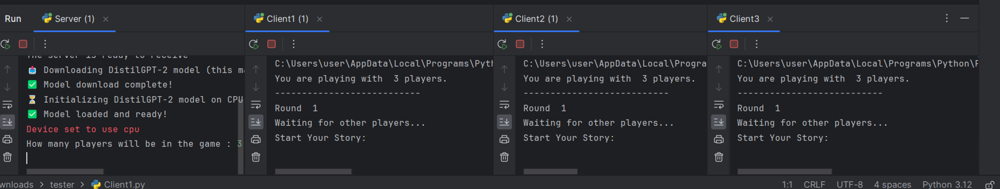
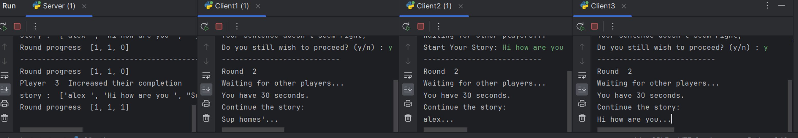
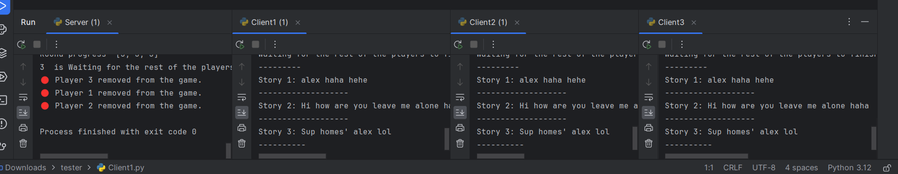
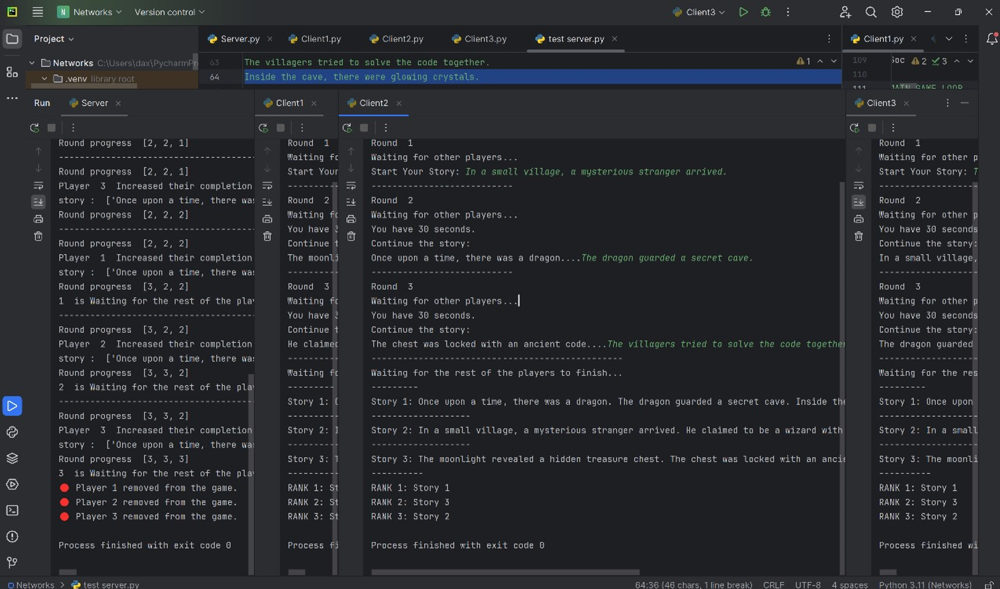

# Gartic Phone CLI + AI

\-\-\- Originally made for CSC 430 Assignment 2 \-\-\-

Description: A command-line interface (CLI) implementation of the Gartic Phone collaborative storytelling game, enhanced with AI capabilities. Players connect via TCP sockets, contribute segments to evolving stories. If a player disconnects or time out, instead of permanently ruining a segment of the game, they are replaced by AI substitutes (using local lightweight models like distilgpt2 via transformers or external APIs like LLaMA 3 via OpenRouter). Features include multithreaded server handling, nltk-based input validation, AI agents with 3 characters to replace disconnected players, and AI-powered voting for the final round.

## How to Run

### Prerequisites
Before running, ensure the following libraries are installed:
* Pytorch
* nltk
* transformers

**Important Note:** On the first run, approximately 50 MB of additional data will be downloaded.

### Execution Steps
1.  **Launch the Server:** Run the server script first.
2.  **Select Chat Model:** Follow the on-screen prompts to select a chat model.
3.  **Select Number of Players:** Choose the number of players (minimum of 3).
4.  **Launch Clients:** Launch all client instances that will participate.
5.  **Wait for Connection:** If the specified number of clients hasn't connected, the server will wait until all clients join before starting the game.

## Screenshots

* **1st Round:**
    

* **Intermediate Rounds:**
    

* **Final Round:**
    

* **All Together (with Voting Phase):**
    
  
## Explanation of Code

### Server Side
1.  **Initialization:**
    * Initialize the server.
    * Prompt the user to select a chatbot model.
    * Prompt the user for the number of players (minimum 3 required).
    * Initialize lists for threads, player tracking, and status Booleans.
2.  **Connection Handling (Loop):**
    * While the game hasn't started:
        * Accept incoming client connections.
        * Send the total player count to the connecting client.
        * Create and start a new thread for each client using the `clienthandler` function, passing the socket and a unique player index (0, 1, 2...).
        * Store the thread and increment the current player count.
    * Once `currentPlayerCount` equals `totalPlayercount`, set game status Booleans to true.
3.  **Game Start:**
    * Start all client handler threads.
    * Wait for all threads to complete.
    * End the main server loop.
4.  **Client Handler Function (`clienthandler`):**
    * Set a socket timeout to handle idle or disconnected players. Chatbots substitute for disconnected players.
    * The game proceeds in rounds, up to `player count + 1`. The last round involves printing the final stories.
    * **Round Logic (excluding the last round):**
        * Players wait until everyone completes the current round (`checkRoundOver` function). A round finishes when all players submit input or disconnect (triggering chatbot substitution).
        * **Round 0:** Clients print "Start".
        * **Subsequent Rounds:** Stories are passed circularly (e.g., player 1 gets player 0's story).
        * **Disconnection/Timeout Handling:** If a socket fails, mark the player as offline, send a (potentially unreceived) timeout message, set their message to "---", and have a chatbot take over for future rounds.
    * **Last Round:** Print all generated stories.
    * **Voting:** The Ollama Chatbot determines the winner.

### Client Side
1.  **Connection:** Connect to the server.
2.  **Gameplay Loop:**
    * Each round: Send validated input to the server.
    * Next round: Receive input from another client or a chatbot.
3.  **Timeout:** Clients who take too long are timed out and disconnected.
